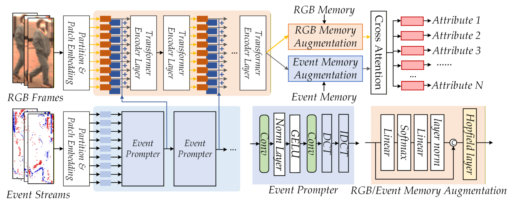
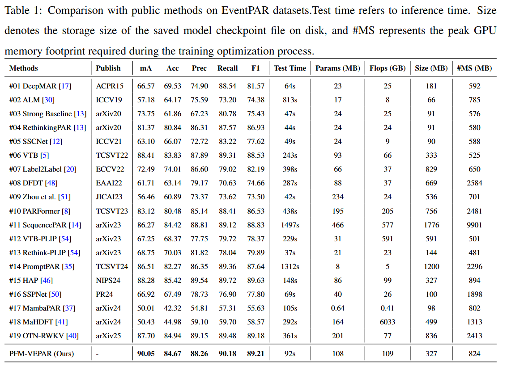
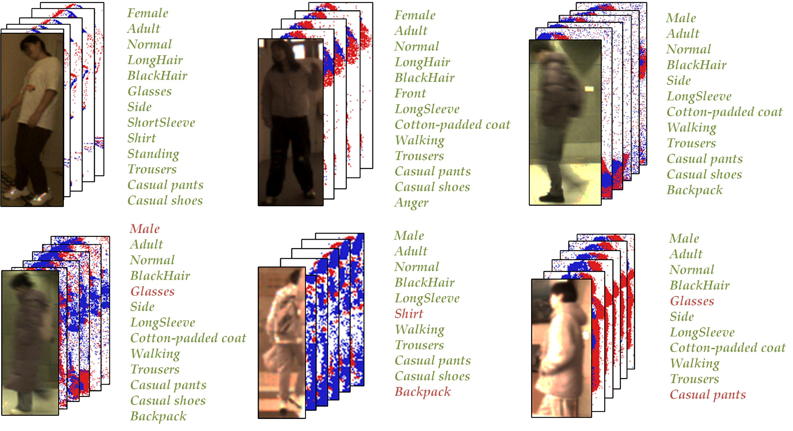

## PFM-VEPAR: Prompting Foundation Models for RGB-Event Camera based Pedestrian Attribute Recognition

<p align="center">
  
</p>

> **[PFM-VEPAR: Prompting Foundation Models for RGB-Event Camera based Pedestrian Attribute Recognition]()**, Minghe Xu, Rouying Wu, ChiaWei Chu, Xiao Wang, Yu Li*


#### Abstract
Event-based pedestrian attribute recognition (PAR) leverages motion cues to enhance RGB cameras in low-light and motion-blur scenarios, enabling more accurate inference of attributes like age and emotion. However, existing two-stream multimodal fusion methods introduce significant computational overhead and neglect the valuable guidance from contextual samples. To address these limitations, this paper proposes an Event Prompter. Discarding the computationally expensive auxiliary backbone, this module directly applies extremely lightweight and efficient Discrete Cosine Transform (DCT) and Inverse DCT (IDCT) operations to the event data. This design extracts frequency-domain event features at a minimal computational cost, thereby effectively augmenting the RGB branch. Furthermore, an external memory bank designed to provide rich prior knowledge, combined with modern Hopfield networks, enables associative memory-augmented representation learning. This mechanism effectively mines and leverages global relational knowledge across different samples. Finally, a cross-attention mechanism fuses the RGB and event modalities, followed by feed-forward networks for attribute prediction. Extensive experiments on multiple benchmark datasets fully validate the effectiveness of the proposed RGB-Event PAR framework.

### :rocket: News:


### Usage
we use single RTX 4090D 24G GPU for training and evaluation.

### Environment Requirements 
```
conda create -n PFMVEPAR python=3.9
conda activate PFMVEPAR
pip install -r requirements.txt
```
The information about the required packages for the virtual environment can be found in [[package_list.txt](https://github.com/Event-AHU/OpenPAR/tree/main/PFM-VEPAR/package_list.txt)]

### Data Preparation
The required data file for this project is in .pkl format, which can be obtained from the following link:
[[EventPAR](https://github.com/Event-AHU/OpenPAR/tree/main/EventPAR_Benchmark)]

### Training
```
CUDA_VISIBLE_DEVICES=0 python train.py --cfg ./configs/pedes_baseline/EventPAR.yaml
```
or

```
bash train_gpu.sh
```
### Evaluation
You can evaluate the performance of the model using the infer.py script.

### Experimental Results 


### Visualization


###  Acknowledgement
Our code is extended from the following repositories. We sincerely appreciate for their contributions.
* [RethinkingOfPAR](https://github.com/valencebond/Rethinking_of_PAR)
* [EventPAR](https://github.com/Event-AHU/OpenPAR/tree/main/EventPAR_Benchmark)

### Citation 
```
@misc{xu2026PFMVEPAR,
      title={PFM-VEPAR: Prompting Foundation Models for RGB-Event Camera based Pedestrian Attribute Recognition}, 
      author={Minghe Xu and Rouying Wu and ChiaWei Chu and Xiao Wang and Yu Li},
      year={2026},
      eprint={2603.19565},
      archivePrefix={arXiv},
      primaryClass={cs.CV},
      url={https://arxiv.org/abs/2603.19565}, 
}
```
