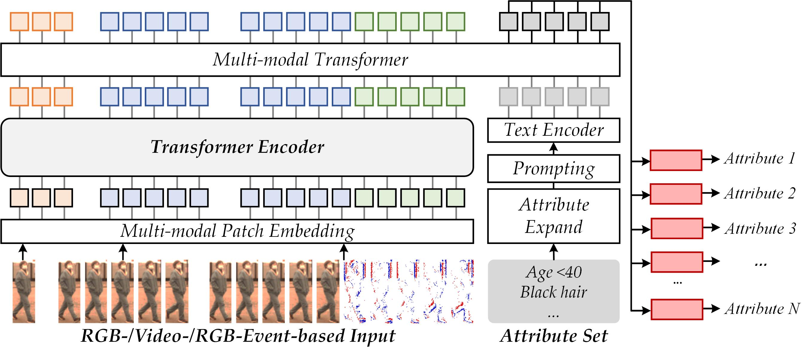

<h2 align="center"> UniPAR: A Unified Framework for Pedestrian Attribute Recognition </h2>

<p align="center">
  
</p>

## 📋 Overview

UniPAR is a unified framework for pedestrian attribute recognition that leverages advanced transformer-based architectures to achieve state-of-the-art performance across multiple datasets. The framework provides a flexible and extensible platform for training and evaluating pedestrian attribute recognition models with support for various datasets and training strategies.

## ✨ Key Features

- **Unified Architecture**: Based on Vision Transformer (ViT) for consistent performance across datasets
- **Multi-dataset Support**: Compatible with DUKE, EventPAR, and MSP60k datasets
- **Flexible Configuration**: Comprehensive hyperparameter tuning options
- **Advanced Training Strategies**: Support for multi-dataset training and various loss functions
- **Easy-to-use Interface**: Simple command-line interface for training and evaluation

## 🔧 Requirements

### Installation
```bash
pip install -r requirements.txt
```

```
### Pre-trained Model
Download the ImageNet pre-trained ViT-Base model:
- [ViT-Base](https://github.com/rwightman/pytorch-image-models/releases/download/v0.1-vitjx/jx_vit_base_p16_224-80ecf9dd.pth)

## 🚀 Training

### Single Dataset Training
```bash
python train.py --dataset [DATASET_NAME]
```

Example:
```bash
python mix_train.py --dataset PA100k
```

### Multi-dataset Training
```bash
python mix_train.py --dataset [DATASET1,DATASET2,...] --save_place [SAVE_DIRECTORY]
```

Example:
```bash
python mix_train.py --dataset PA100k,DUKE,EventPAR --save_place multi_dataset_experiment
```

### Training Configuration
The framework supports various training configurations through command-line arguments:

```bash
python mix_train.py --dataset PA100k --batchsize 8 --epoch 200 --lr 8e-3 --height 256 --width 128
```

## 📊 Evaluation

To evaluate a trained model, use the `test.py` script:

```bash
python test.py 
```

## 📁 Project Structure

```
UniPAR/
├── assets/              # Project assets (images, logos)
├── dataset/             # Dataset handling and preprocessing
│   ├── preprocess/      # Data preprocessing scripts
│   └── AttrDataset.py   # Dataset class definition
├── loss/                # Loss functions
├── models/              # Model architectures
│   ├── vit.py           # Vision Transformer implementation
│   └── base_block.py    # Base network blocks
├── solver/              # Optimizers and learning rate schedulers
├── tools/               # Utility functions
├── visualize/           # Visualization results
├── config.py            # Configuration settings
├── train.py             # Training script
├── test.py              # Evaluation script
└── requirements.txt     # Dependencies
```

## 📌 Citation

If you use UniPAR in your research, please consider citing:

```

```

## 👍 Acknowledgements

This code is based on the following works:
- [Rethinking_of_PAR](https://github.com/valencebond/Rethinking_of_PAR)
- [TransReID](https://github.com/damo-cv/TransReID)

Special thanks to the authors for their contributions to the field of pedestrian attribute recognition.
